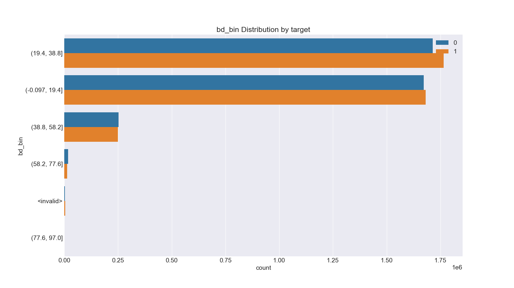
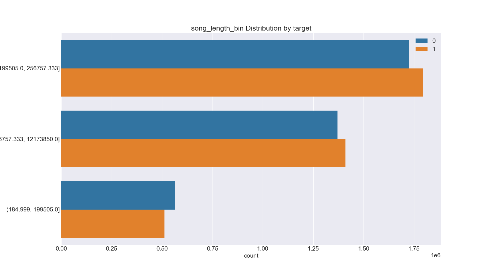

**kaggle-kkbox-music-recommendation-challenge**
==============================================

Kaggle Competition [WSDM - KKBox's Music Recommendation Challenge](https://www.kaggle.com/c/kkbox-music-recommendation-challenge) 에서 제공하는 데이터 세트를 활용한 EDA 및 추천 과제 해결한다.

---

# Data Analysis

## 1. Exploratory Data Analysis

데이터에 대한 EDA를 수행하고 시각화 자료를 figures 디렉터리에 생성한다.

```
python eda.py
```

Kaggle에서 제공하는 데이터는 다음과 같다.

|파일 이름|열(column) 이름|내용|
|-------|-------------|---|
|trian.csv|msno|사용자 ID|
||song_id|노래 ID|
||source_system_tab|이벤트가 발생한 탭. KKBox 모바일 애플리케이션 기능|
||source_screen_name|사용자 화면 레이아웃|
||source_type|모바일 애플리케이션에서 사용자가 노래를 재생한 지점|
||target|한 달 내에 사용자가 노래를 다시 듣는지 여부|
|test.csv|id|레코드 ID|
||msno|사용자 ID|
||song_id|노래 ID|
||source_system_tab|이벤트가 발생한 탭. KKBox 모바일 애플리케이션 기능|
||source_screen_name|사용자 사용한 화면 레이아웃|
||source_type|모바일 애플리케이션에서 사용자가 노래를 재생한 지점|
|sample_submission.csv|id|test.csv 레코드 ID|
||target|한 달 내에 사용자가 노래를 다시 듣는지 여부|
|songs.csv|song_id|노래 ID|
||song_length|노래 길이. ms 단위|
||genre_ids|노래의 장르 ID. 하나의 곡에 대한 복수의 장르는 \| 로 구분|
||artist_name|아티스트 이름|
||composer|작곡가|
||lyricst|작사가|
||language|노래 언어|
|members.csv|msno|사용자 ID|
||city|사용자 소속 도시|
||bd|사용자 나이. outlier 주의|
||gender|사용자 성별|
||registered_via|가입 경로|
||registration_init_time|가입 일시. %Y%m%d 형태|
||expiration_date|만료 일시. %Y%m%d 형태|
|song_extra_info.csv|song_id|노래 ID|
||song_name|노래 제목|
||isrc|노래 식별을 위한 International Standard Recording Code. 검증되지 않은 값으로 사용에 유의|


데이터 파일(CSV 파일)에 있는 레코드의 개수는 다음과 같다.

|파일 이름|레코드 개수|
|-------|--------:|
|trian.csv|7,377,418|
|test.csv|2,556,790|
|sample_submission.csv|2,556,790|
|songs.csv|2,296,320|
|members.csv|34,403|
|song_extra_info.csv|2,295,971|

각 파일의 주요 변수에 대해서 target에 어떠한 영향을 미치는지 확인한다.

### train.csv


종합적으로 보면 Local과 관련된 값에 대해서는 target 값이 1(한 달 안에 다시 듣는다)일 가능성이 높은 것을 알 수 있다. 

### members.csv


사용자 데이터 자체만으로 target 값을 예측하는 것은 어려움이 있다. 

사용자 데이터 중 나이를 의미하는 bd는 0 구간에서 target 값의 대다수가 0이다. 이와 관련해서 두 가지 해석이 가능하다.

1. bd는 outlier 값이 많다. 따라서 bd가 0 구간에서의 target 값은 신뢰하기 어려우며 우연의 일치이다.

2. bd가 0 구간인 것은 사용자가 프로그램에 익숙하지 않아서 나이를 제대로 입력하지 못했기 때문에 발생하였다. 프로그램에 익숙하지 않은 사용자면 노래를 다시 듣는 행위도 어려울 것이다. 따라서 target 값이 0이 나올 개연성은 충분한다. 

이러한 점을 고려해서 데이터 전처리를 수행한다.

### songs.csv


노래 자체의 데이터만으로 target 값을 예측하기에는 상당한 어려움이 있다.

## 2. Data Preprocessing

추천 시스템 모델을 위한 데이터 전처리 과정을 수행한다. 전치리된 파일은 train_merged.csv와 test_merged.csv로 저장한다

~~~
python preprocessing.py
~~~

### train.csv + test.csv

Missing Value는 모두 문자열 '\<blank>'로 변경한다.

train.csv와 test.csv의 변수 source_system_tab, source_screen_name, source_type 중 일부 값만을 선택한다. 선택 기준은 전체적인 빈도 수와 target 값에 영향을 미치는 정도(얼마나 잘 구분하는지)이다.

|변수|선택된 값|기타|
|---|-------|---|
|source_system_tab|my library, discover, search, radio|\<blank>, \<not selected>| 
|source_screen_name|Local playlist more, Online playlist more, Radio, Album more, Search, Artist more, Discover Feature, Discover Chart, Others profile more|\<blank>, \<not selected>|
|source_type|local-library, online-playlist, local-playlist, radio, album, top-hits-for-artist|\<blank>, \<not selected>|


### members.csv

Missing Value는 모두 문자열 '\<blank>'로 변경한다.

members 데이터의 변수 중 expiration_date와 registration_init_time을 활용하여서 멤버십 기간(membership_days)를 구한다.

members 데이터의 변수 중 bd와 생성한 membership_days는 모두 연속형 데이터이다. 현재 대다수의 변수가 범주형 데이터이므로 연속형 데이터를 구간을 나누어서 범주형 데이터로 변환한다. 

membership_days는 qcut을 사용해서 3개의 구간을 나누고 각 구간의 데이터 수가 균등하게 분배하였다. membership 기간은 항상 양수임을 보장하기 위해서 0 보다 작은 경우 \<invalid> 를 할당했다.

bd는 cut을 사용해서 5개의 구간으로 나이를 나누었다. 특히 bd는 0 미만 100 이상인 경우에는 \<invalid> 를 할당했다.

members의 또 다른 변수 city와 registered_via에서 빈도수가 많은 값 만을 선택하고 나머지는 \<not selected>로 처리했다.

|변수|선택된 값|기타|
|---|-------|---|
|city|1, 13, 15, 22, 4, 5|\<not selected>| 
|gender|female, male|\<blank>|
|registered_via|3, 4, 7, 9|\<not selected>|
|membership_days_bin|(-0.001, 301.0], (301.0, 1390.0], (1390.0, 5149.0]|\<invalid>|
|bd_bin|(-0.097, 19.4], (19.4, 38.8], (38.8, 58.2], (58.2, 77.6], (77.6, 97.0]|\<invalid>|




### songs.csv + song_extra_info.csv

Missing Value는 모두 문자열 '\<blank>'로 변경한다.

song_length가 0보다 작은 경우는 '\<invalid>'로 변경하고 qcut을 사용해서 세 구간으로 데이터 수가 균등하게 나눈다.

빈도수가 높은 5개의 장르만을 선정한다. 하나의 노래에 두 개의 장르가 붙을 수 있으므로 개별 장르에 대한 변수(열)을 추가해서 생성한다.

langauge 중 일부만을 선택한다.

추가로 song_extra_info에는 노래의 isrc 코드가 있다. isrc 코드에서 나라 코드와 등록연도를 추가적으로 구할 수 있다. 상위 빈도의 값 만을 선택한다.

|변수|선택된 값|기타|
|---|-------|---|
|song_length_bin|(184.999, 199505.0], (199505.0, 256757.333], (256757.333, 12173850.0]|\<blank>| 
|genre_465|0, 1||
|genre_958|0, 1||
|genre_1609|0, 1||
|genre_2022|0, 1||
|genre_2122|0, 1||
|languge|10, 24, 3, 31, 52|\<blank>, \<not selected>|
|country|DE, FR, GB, JP, TC, US|\<blank>, \<not selected>|
|year_bin|(1918.999, 2002.0], (2002.0, 2009.0], (2009.0, 2013.0], (2013.0, 2015.0], (2015.0, 2018.0]|\<blank>|




## 3. Recommendation Modeling

과제 수행을 위한 target 값을 예측한다. 과제 정의상 AUC로 평가받는다.

~~~
python recommendation.py
~~~

추천 모델을 두 가지 방식으로 접근한다.

1. Content 기반으로 신경망 학습. Keras Style의 간단한 Fully Connected 신경망을 구축하고 Sigmoid를 마지막 Layer로 하는 Binary Classification 문제로 추천을 접근한다. 전처리한 데이터를 종합하여서 특징들을 추출하고 이를 바탕으로 target 값을 예측하는 Binary Classifier를 구현한다.
2. 전통적인 추천 모델은 Matrix Factorization 기반으로 User Vector와 Item Vector를 구하고 이를 기반으로 Rating을 추론하는 것이다. Rating에 해당하는 target 값은 0 또는 1이므로, 구성 요소에 음수가 없는 NMF 모델을 사용해서 Rating을 추론한다.

학습 데이터를 8 대 2 비율로 학습 데이터와 검증 데이터로 나누고 각 모델을 AUC Score로 평가한다.

### 신경망 모델: AUC 0.6794

학습을 위한 데이터의 크기는 (5901934, 80)이다. 신경망 모델은 하나의 입력층과 하나의 출력층으로 구성한다. 입력층에는 80x32의 가중치가 있으며 ReLU를 활성화 함수로 사용한다. 출력층에는 32x1의 가중치가 있으며 Sigmoid를 활성화 함수로 사용한다. 대부분이 0과 1의 범주형 데이터이므로 복잡한 모델 보다 간단한 모델이 오버피팅을 피하는 방법이라고 판단하였다.


학습 결과 검증 데이터에 대해서 0.6794의 AUC 점수를 보였다.

### NMF 모델: AUC 0.6252

Matrix Factorization을 통해 User Vector와 Item Vector를 구하고, 최종적으로 Rating을 추론하는 방법이다. 

NMF는 기본적으로 양수만을 데이터로 삼기 때문에 추론된 Rating이 1보다 큰 경우는 모두 1로, 0보다 작은 경우(사실상 없음)는 모두 0으로 처리한다.

NMF 모델은 0.6252의 성능을 보였으며 학습을 위한 시간이 상당히 많이 소요되었다.


최종적인 모델은 신경망 모델과 NMF 모델을 0.6 대 0.4로 가중합하였다. 해당 모델에 대해서는 AUC Score가 0.7174로 가장 좋은 모델이라고 할 수 있다.

학습용 데이터와 검증용 데이터를 다시 병합하여서 모델을 다시 학습시킨다. 재학습된 모델을 바탕으로 과제를 위한 target 값을 추론하여 제출한다. 

Kaggle에 제출 결과 Public Score로 0.63641, Private Score로 0.63889를 얻었다.


# Conclusion

기본적인 추천 모델을 구현하였다. Baseline을 웃도는 성적이지만 크게 상회하지는 못하였다. 전체적인 성능 향상이 필요하다.

Kaggle에 올라와있는 notebook을 확인해보면 대체적으로 lightbgm을 사용한 것을 알 수 있다. 다양한 머신 러닝 기법을 사용한 성능 향상을 실험할 필요성이 있다.

--------------------------------------------

# History

## 1. EDA
데이터 세트에 대한 EDA 및 시각화. [링크](notebooks/reports/Exploratory%20Data%20Analysis.md)

* 사용자와 노래에 대한 데이터를 분석한다.
* 사용자와 노래에 대한 데이터가 예측값(target)에 어떠한 영향을 주는지 확인한다
* 분석 결과를 Barplot, Boxplot, KDEplot을 통해 시각화한다.

---

## 2. Model - v1
기본적인 Matrix Factorization 기반의 데이터 모델링. [링크](notebooks/reports/Model%20v1.md)

* 테스트 데이터에 대해서 정활률 0.54589
* Sample Submission 0.5000 보다 높지만 KKbox Benchmark 인 0.61337 보단 낮은 결과
* 성능 개선 방법
  1. 현재 모델의 하이퍼파라미터(반복 횟수, Feature 개수) 조정. - Kaggle Kernel에서 수행 권장. [링크](https://www.kaggle.com/dhsong13/model-v1-mf-hyper-parameter-adjustment)
  2. K-NN 기반의 방법 + IDF 가중치를 활용한 방법

## 3. Model - v2
Negative Feedback을 반영한 Matrix Factorization + Content Based Neural Network의 데이터 모델링. [링크](notebooks/reports/Model%20v2.md)

* 테스트 데이터에 대해서 정활률 0.58346
* Model v1 보다 향상되었지만 KKbox Benchmark 인 0.61337 보단 낮은 결과
* 성능 개선 방법
  1. 다양한 Binary Classificatino 모델 실험 - Kaggle Kernel에서 수행 권장.