**Exploratory Data Analysis**
==============================

## **1. Data Description**

Kaggle Competition [KKBOX Music Recommendataion Challenge](https://www.kaggle.com/c/kkbox-music-recommendation-challenge) 문제를 해결한다. 제공하는 데이터 파일은 총 6개이다. 데이터 파일은 압축된 csv 파일이다. 

|파일 이름|열(column) 이름|내용|
|-------|-------------|---|
|trian.csv|msno|사용자 ID|
||song_id|노래 ID|
||source_system_tab|이벤트가 발생한 탭. KKBox 모바일 애플리케이션 기능|
||source_screen_name|사용자 화면 레이아웃|
||source_type|모바일 애플리케이션에서 사용자가 노래를 재생한 지점|
||target|한 달 내에 사용자가 노래를 다시 듣는지 여부|
|test.csv|id|레코드 ID|
||msno|사용자 ID|
||song_id|노래 ID|
||source_system_tab|이벤트가 발생한 탭. KKBox 모바일 애플리케이션 기능|
||source_screen_name|사용자 사용한 화면 레이아웃|
||source_type|모바일 애플리케이션에서 사용자가 노래를 재생한 지점|
|sample_submission.csv|id|test.csv 레코드 ID|
||target|한 달 내에 사용자가 노래를 다시 듣는지 여부|
|songs.csv|song_id|노래 ID|
||song_length|노래 길이. ms 단위|
||genre_ids|노래의 장르 ID. 하나의 곡에 대한 복수의 장르는 \| 로 구분|
||artist_name|아티스트 이름|
||composer|작곡가|
||lyricst|작사가|
||language|노래 언어|
|members.csv|msno|사용자 ID|
||city|사용자 소속 도시|
||bd|사용자 나이. outlier 주의|
||gender|사용자 성별|
||registered_via|가입 경로|
||registration_init_time|가입 일시. %Y%m%d 형태|
||expiration_date|만료 일시. %Y%m%d 형태|
|song_extra_info.csv|song_id|노래 ID|
||song_name|노래 제목|
||isrc|노래 식별을 위한 International Standard Recording Code. 검증되지 않은 값으로 사용에 유의|

 데이터 파일(CSV 파일)에 있는 레코드의 개수는 다음과 같다.

|파일 이름|레코드 개수|
|-------|--------:|
|trian.csv|7,377,418|
|test.csv|2,556,790|
|sample_submission.csv|2,556,790|
|songs.csv|2,296,320|
|members.csv|34,403|
|song_extra_info.csv|2,295,971|

---

## **2. Basic EDA on each Column Data**

### **1. train.csv and test.csv**

train.csv와 test.csv는 msno, song_id, source_system_tab, source_screen_name, source_typ 변수를 공통적으로 가진다. train.csv와 test.csv를 통합해 변수의 전체적인 분포를 확인한다. target를 포함한 train.csv를 참고해 변수와 target의 관계를 확인한다.

** source_system_tab**

source_system_tab은 이벤트가 발생한 탭으로 KKBox 모바일 애플리케이션의 기능에 대한 카테고리이다. 

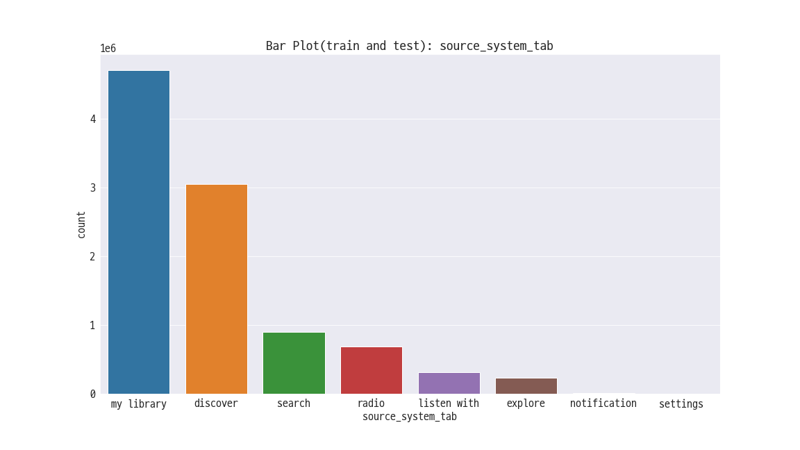

사용자의 노래 재생은 "my library" 기능과 "discover" 기능에서 주로 이루어졌다.

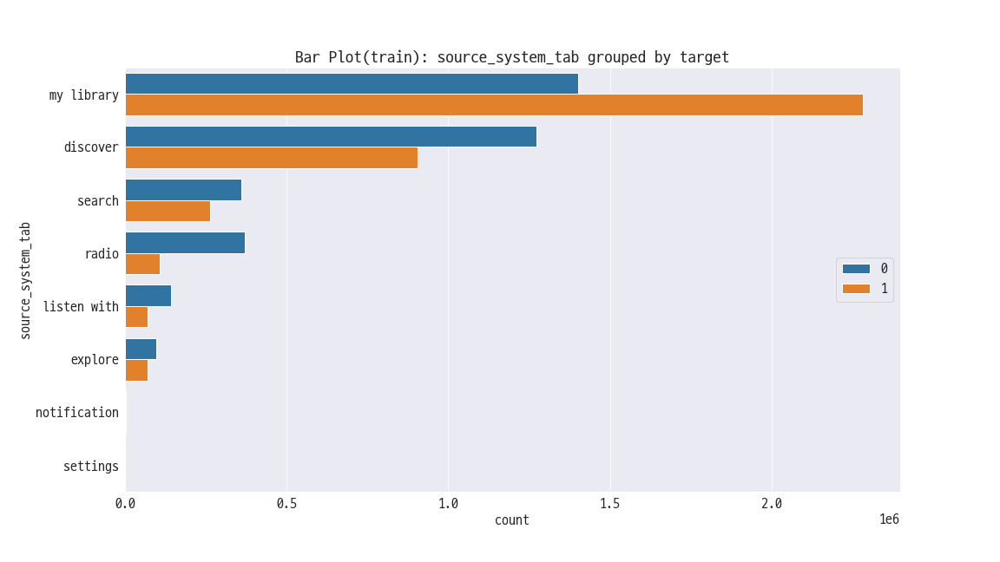

target에 영향을 주는 source_system_tab의 값으로는 "my library", "discover", "radio"가 있다. 

사용자가 "my library" 기능을 통해 재생한 음악은 한 달 안에 다시 재생될 가능성이 높다. 

사용자가 "discover" 기능을 통해 재생한 음악은 한 달 안에 다시 재생되지 않을 가능성이 높다. 하지만 재생될 가능성과의 차이는 크지 않다. 

사용자가 "radio" 기능을 통해 재생한 음악은 한 달 안에 다시 대생되지 않을 가능성이 높다. 비록 전체 빈도는 "my library", "discover" 보다 낮지만, target 값을 0으로 예측하는 주요한 지표이다. 

** source_screen_name**

source_screen_name은 사용자가 노래를 재생한 화면 레이아웃이다. 

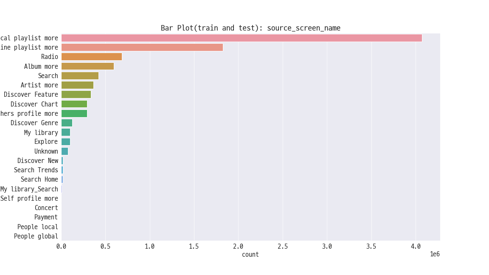

사용자는 "Local playlist more" 화면과 "Online playlist more" 화면에서 노래를 많이 재생하였다.

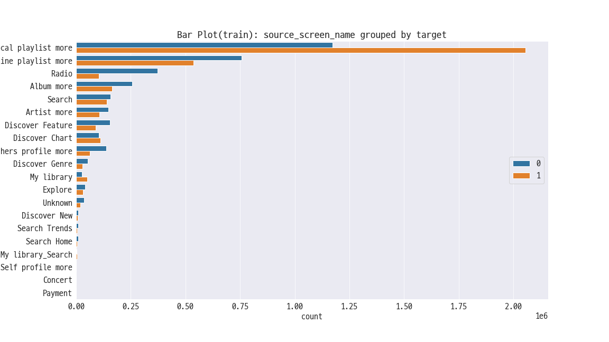

target에 영향을 주는 source_screen_name의 값으로는 "Local playlist more", "Online playlist more", "Radio"가 있다.

"Local playlist more" 화면에서 재생한 음악은 한 달 안에 다시 재생될 가능성이 높다. 

"Online playlist more" 화면에서 재생한 음악은 한 달 안에 다시 재생되지 않을 가능성이 높다. 하지만 재생될 가능성과의 차이는 크지 않다. 

"Radio" 화면에서 재생한 음악은 한 달 안에 다시 재생되지 않을 가능성이 높다. 비록 전체 빈도는 "Local playlist more"과 "Online playlist more" 보다 낮지만, arget 값을 0으로 예측하는 주요한 지표이다.

** source_type**

source_type은 모바일 애플리케이션에서 사용자가 노래를 재생한 진입점(지점)이다. 

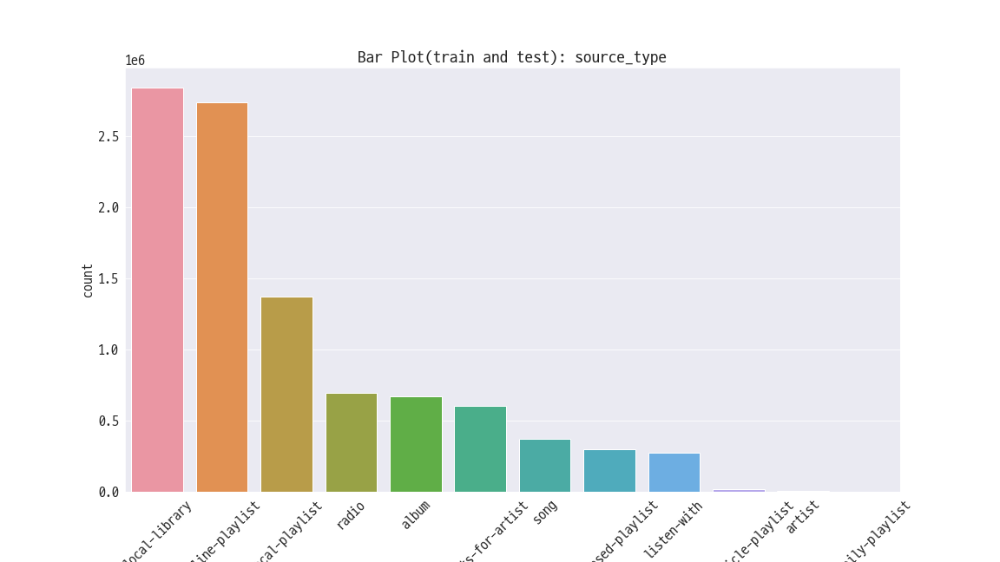

사용자는 "local-library", "online-playlist", "local-playlist"에서 노래를 많이 재생하였다. 

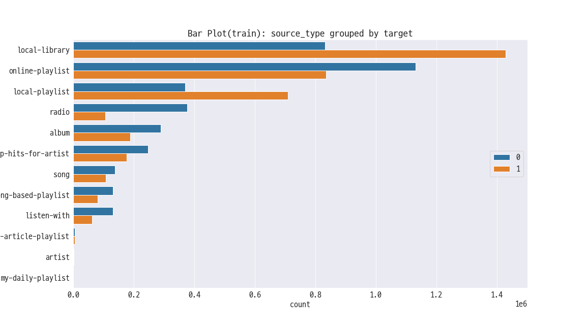

target에 영향을 주는 source_screen_name의 값으로는 "local-library", "online-playlist", "local-playlist", "Radio"가 있다.

"local-library" 또는 "local-playlist" 에서 재생한 음악은 한 달 안에 다시 재생될 가능성이 높다. 

"online-playlist" 또는 "Radio" 에서 재생한 음악은 한 달 안에 다시 재생되지 않을 가능성이 높다.

 종합하면 "local"과 관련된 음악 재생은 한 달 안에 다시 반복될 가능성이 높다. local에서 노래를 듣는다는 것은 사용자가 그 노래를 자주 듣거나 좋아한다고 해석할 수 있다. 따라서 "my library" 기능으로 노래를 듣거나, "local-library" 화면에서 노래를 듣거나, "local-library" 또는 "local-playlist"에서 노래를 듣는 것은 한 달 안에 반복될 가능성을 높인다.

local에서 노래를 듣는 것은 사용자의 선택(특히 선호에 의한 선택)과 관련되어있다. 이와 관련해서 사용자의 선택과 무관한 음악 감상은 반복될 가능성을 낮출 것으로 예상할 수 있다. 대표적인 예가 "radio" 이다. "radio" 기능을 사용하였거나, "Radio" 화면에서 이루어졌거나, "radio"에서 이루어진 음악 감상은 사용자의 직접적인 선택이 아니므로 한 달 안에 반복될 확률이 낮다. 

### **2. members.csv and train.csv**

members.csv는 사용자 정보와 관련된 데이터로 msno, city, bd, gender, registed_via, registration_init_time, exipration_date 변수를 관리하고 있다. members.csv에 있는 변수의 전체적인 분포를 확인하고 train.csv와 JOIN 하여서 members의 변수들과 train.csv의 target이 가지는 관계를 파악한다.

** city**

city는 사용자가 속한 도시이다. 숫자로 표현되어 있다.  

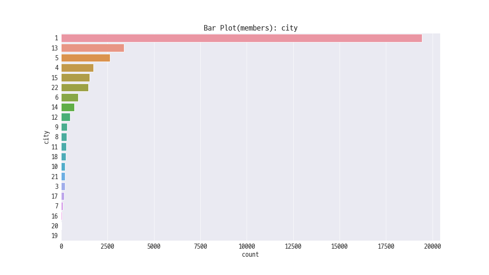

사용자의 대부분은 도시 1에 속한다.

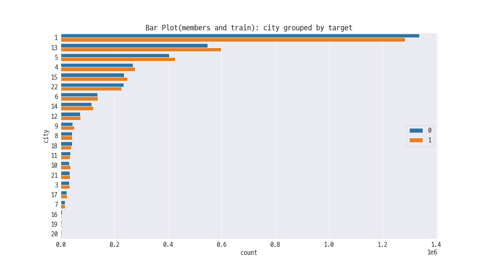

target에 영향을 주는 city의 값을 특정하기 어렵다.

** bd**

bd는 사용자의 나이이다. 

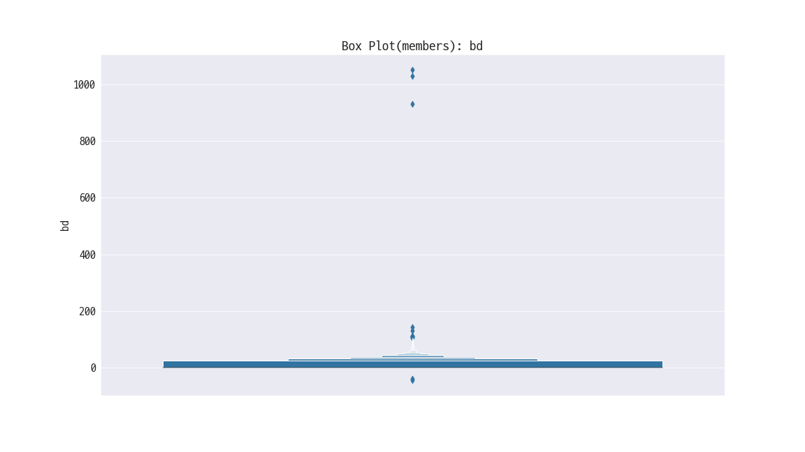

일반적으로 나이는 0에서 100 사이로 예상한다. 하지만 Boxplot 상에서 볼 때 상식적인 범위를 벗어난 값이 있음을 확인할 수 있다.

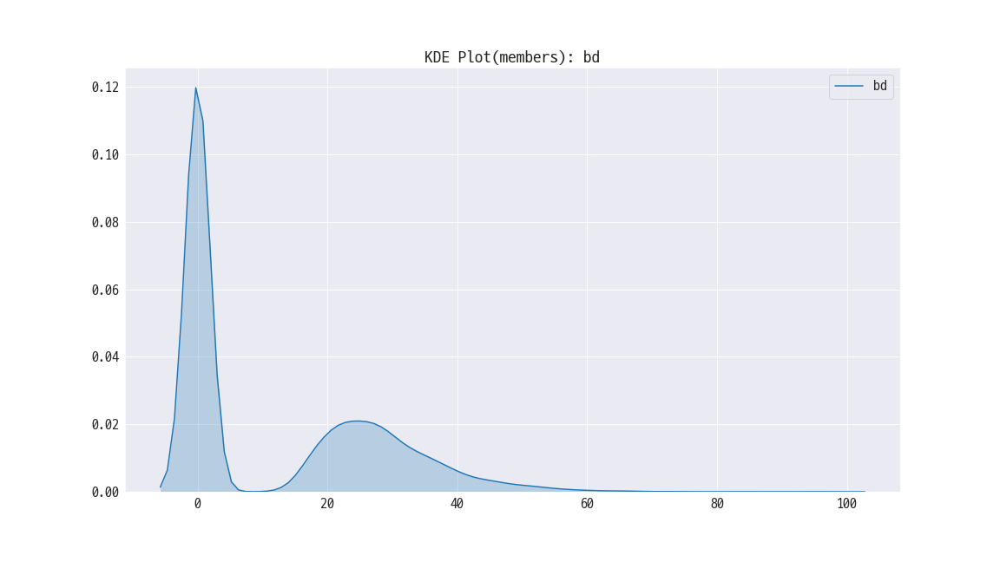

일반적인 나이 범위인 0에서 100 사이의 값에 대해서 KDE Plot을 보면, 20 대의 사용자가 많음을 알 수 있다. 

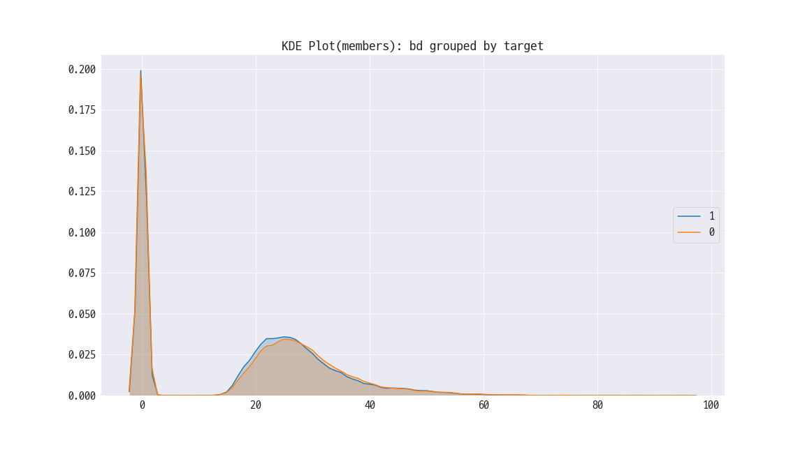

target에 영향을 주는 bd의 범위를 특정하기 어렵다.

** gender**

gender 사용자의 성별이다. 

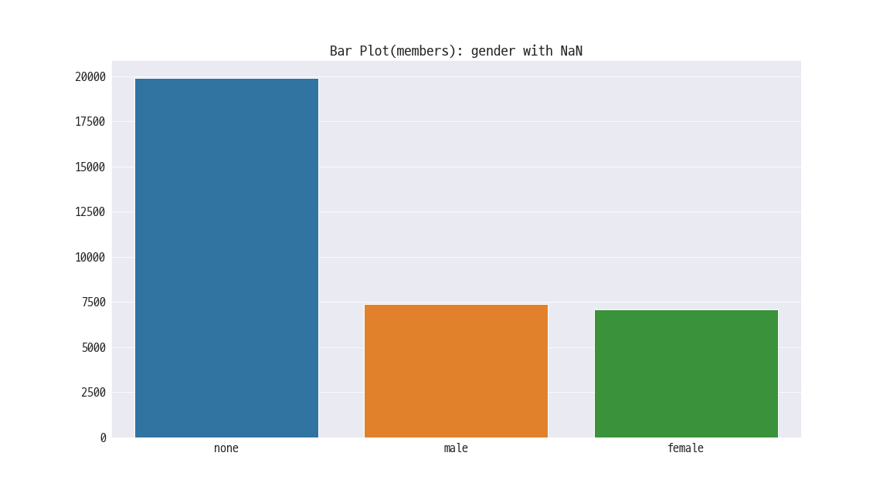

gender는 비어있는 값이 상당히 많다. 남녀 성비 역시 큰 차이 없다.

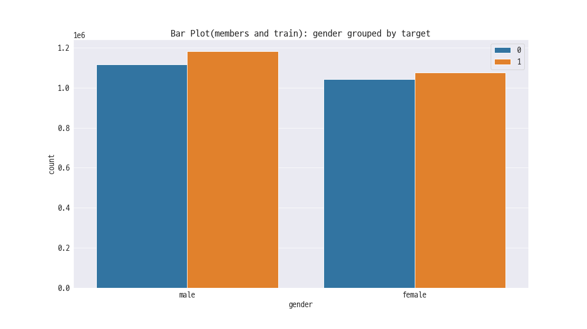

target에 영향을 주는 gender 값을 특정하기 어렵다.

** registered_via**

registered_via는 사용자의 가입 경로이다. 숫자로 표현되어 있으므로 구체적인 내용은 파악하기 어렵다.

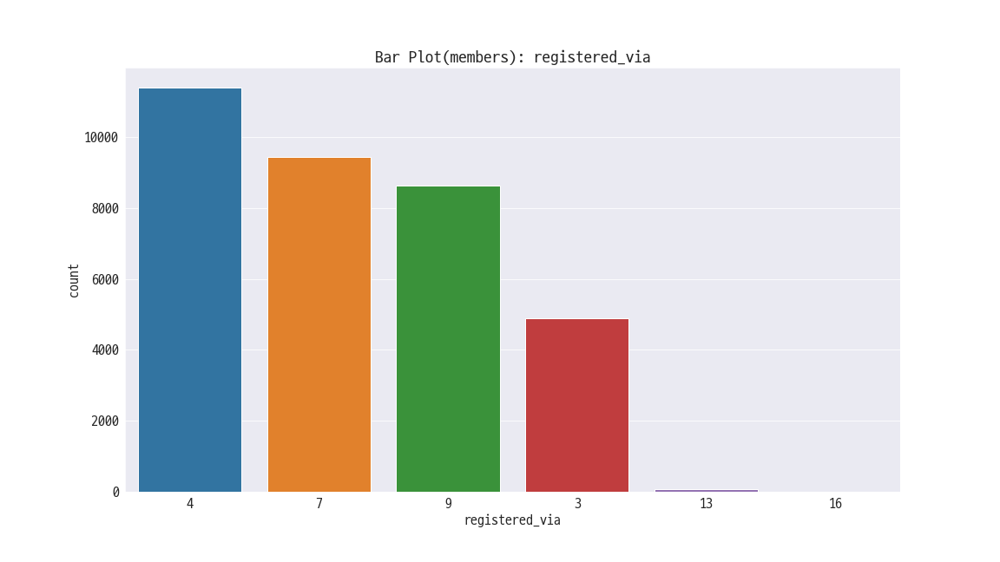

사용자의 대부분은 4, 7, 9를 통해 KKBox에 가입했다.

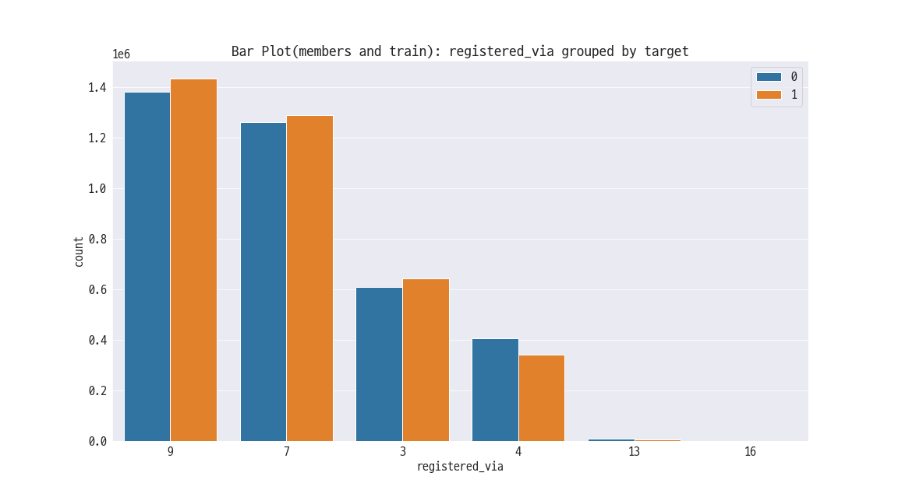

target에 영향을 주는 registered_via 값을 특정하기 어렵다.

** registration_init_time**

registration_init_time 사용자의 가입 시기이다. %Y%m%d 형식이다.

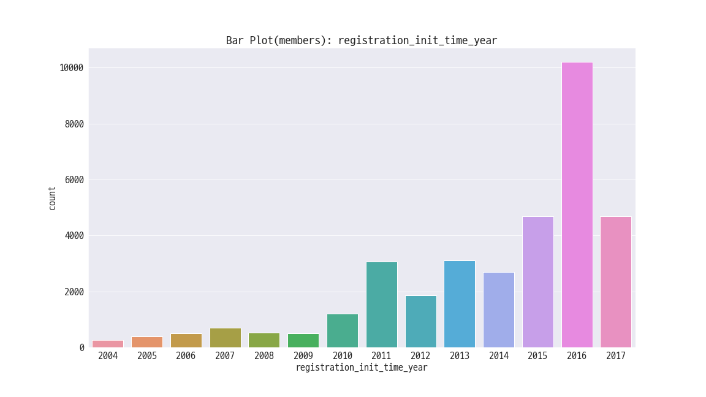

많은 사용자가 2016년에 서비스에 가입했다. 2017년 데이터가 완비되지 않을 가능성이 있으므로 서비스의 가입이 2016년 최고점을 기준으로 급격히 떨어졌다고 해석하기는 어렵다.

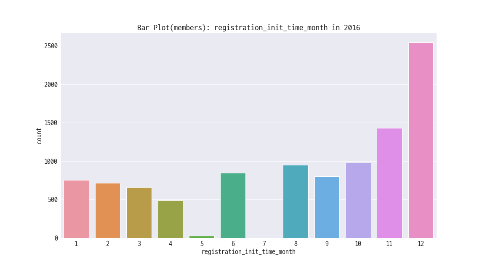

2016년의 달 별 가입자 수 변화를 살펴보면 12월의 가입자 수가 가장 많은 것으로 보아, 2016년 9월부터의 성장세가 가입자 수 최대에 영향을 미친 것으로 볼 수 있다.

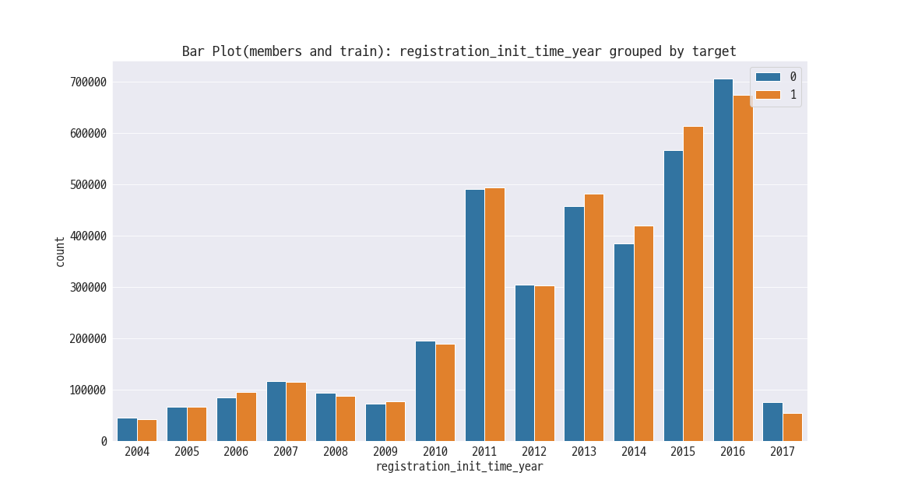

target에 영향을 주는 registration_init_time_year 값을 특정하기 어렵다.

** expiration_date**

expiration_date 사용자의 계정 만료 시기이다. %Y%m%d 형식이다.

많은 사용자의 서비스는 2017년에 만료된다. 2016년 가입자가 많아졌으므로 서비스 만료는 2016년 이후에 이루어질 것으로 예상할 수 있다. 

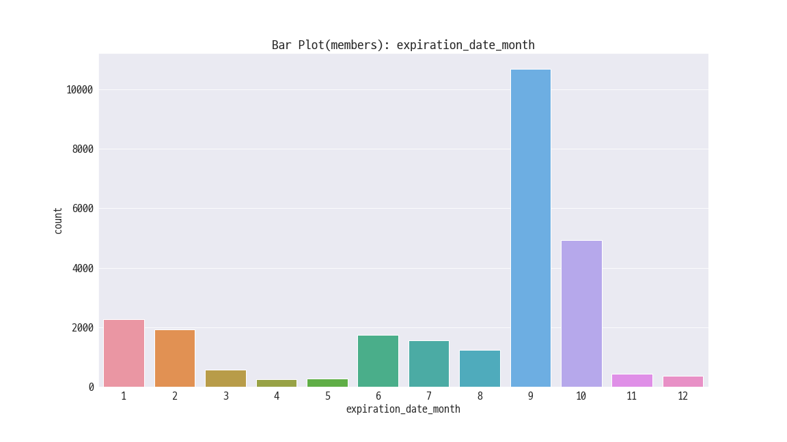

2017년 9월 서비스가 만료되는 사용자가 많다.

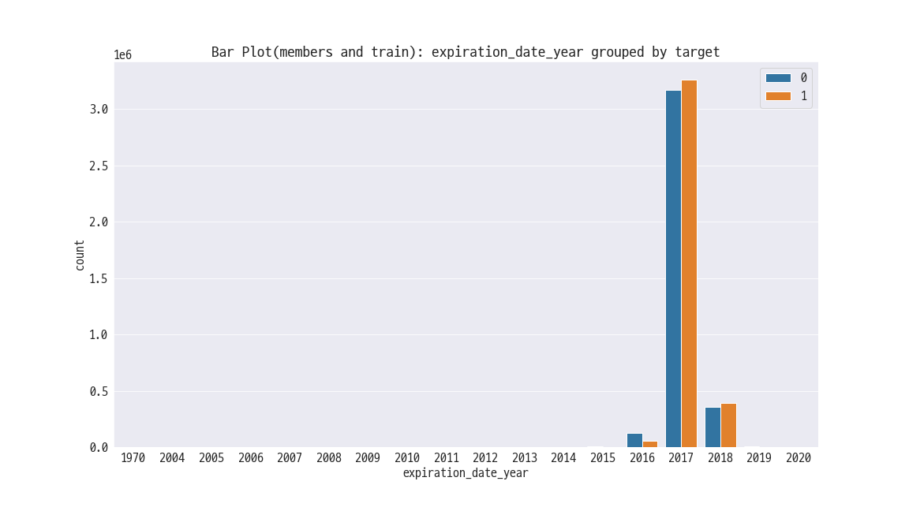

target에 영향을 주는 expiration_date_year 값을 특정하기 어렵다.

 사용자에 대한 데이터를 분석한 결과 다음과 같은 특징을 보인다.

1. 특정 도시(1)에 집중된 사용자 분포
2. 이상치가 많은 나이. 모델 feature로 부적절
3. Missing Value가 많은 서별. 모델 feature로 부적합
4. 어느 정도 균등한 가입 경로
5. 특정 시기에 집중된 가입 시기(2016년 12월)와 만료 시기(2017년 9월)
6. target에 큰 영향을 미치는 변수 부재. 

members.csv는 데이터에 저장된 사용자의 특성을 파악하는데 도움이 될 수 있지만, target 값을 예측하는데는 큰 도움이 되지 않을 것으로 예상한다.

### **3. songs.csv and train.csv**

songs.csv는 노래 정보와 관련된 데이터로 song_id, song_length, genre_ids, artist_name, composer, lyricist, language 변수를 관리하고 있다. songs.csv에 있는 변수의 전체적인 분포를 확인하고 train.csv와 JOIN 하여서 songs.csv에 있는 변수들과 train.csv의 target이 가지는 관계를 파악한다.

** song_length**

song_length는 노래 길이로 ms 단위이다.   

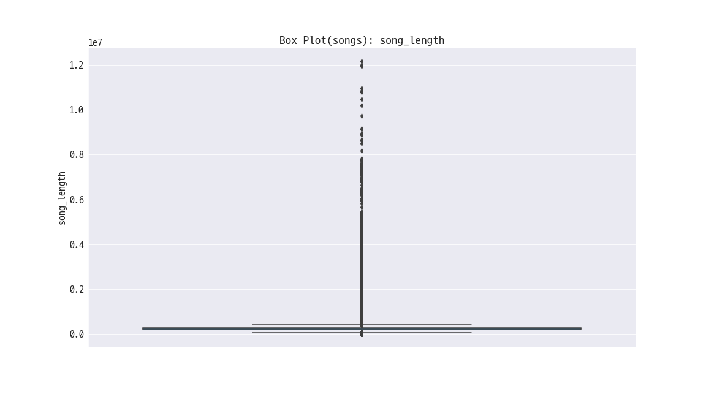

Boxplot 상에서 노래 길이는 일정 범위를 벗어난 값이 많다는 것을 알 수 있다.

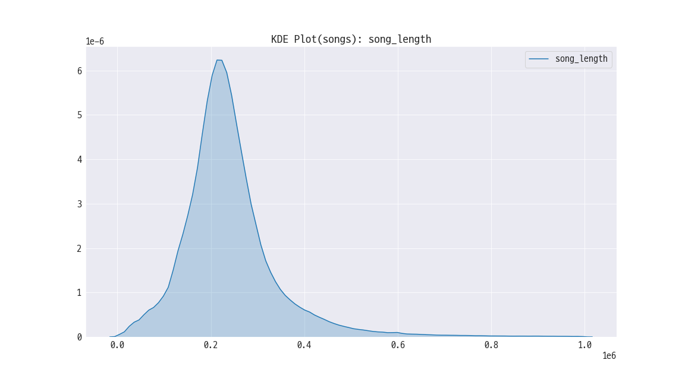

노래 길이가 0ms에서 1000000ms(약 16분) 사이 값에 대해서만 KDE Plot을 시각화한 결과 대부분의 노래 길이는 200000ms(약 3분) 보다 살짝 긴 것으로 나타났다. 일반적인 가요가 3분에서 4분인 것을 생각하면 직관적으로 이해할 수 있는 그래프이다.

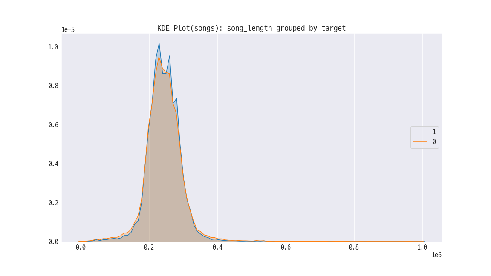

target에 영향을 주는 song_length의 값을 특정하기 어렵다.

** genre_ids**

genre_ids는 노래의 장르 카테고리로 복수의 장르에 속하는 노래도 있다. 복수의 장르는 \| 를 통해 표기한다. 

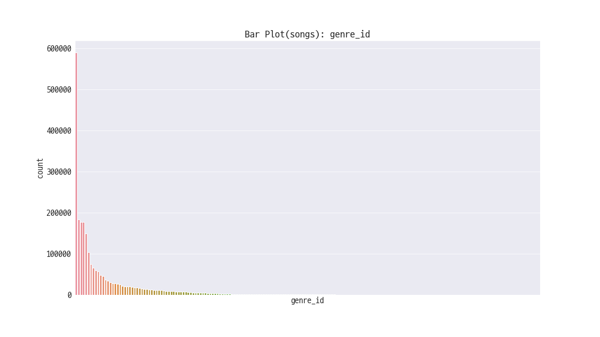

전체적인 장르 분포를 살펴보면 파레토 법칙에 따라 소수의 장르가 많은 빈도를 가지는 것을 알 수 있다. 

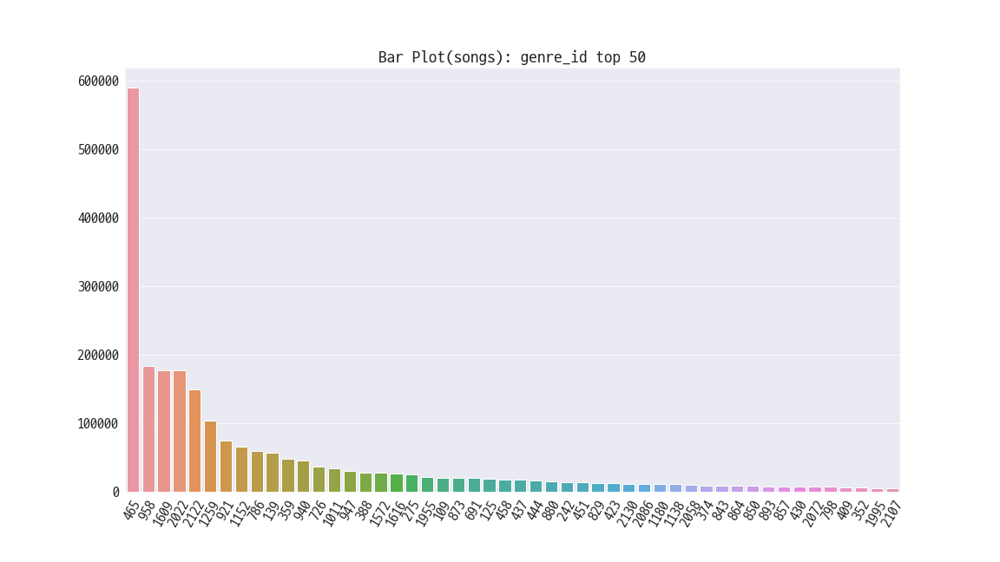

상위 50개의 장르를 확인하면 대부분의 노래가 장르 495에 속하는 것을 알 수 있다. 

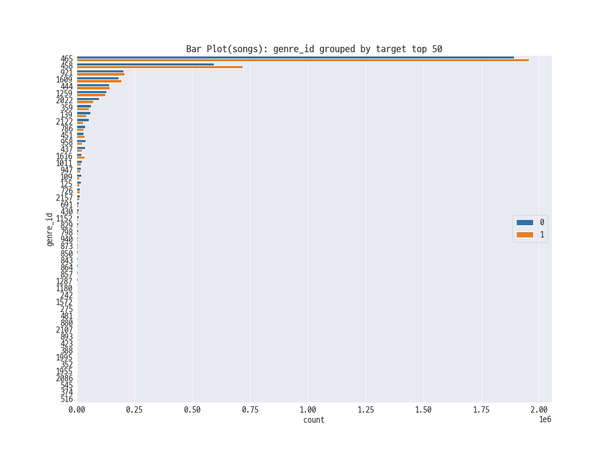

target에 영향을 주는 genre_id의 값을 특정하기 어렵다.

** artist_name**

artist_name은 노래를 부른 가수의 이름이다. 

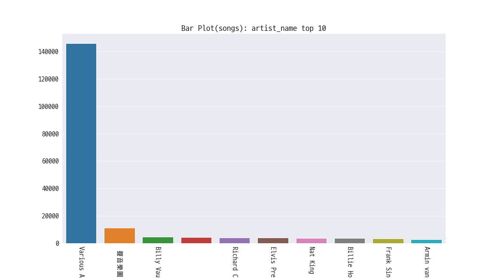

상위 10 명의 가수를 확인한 결과 Various Artists가 가장 많은 빈도를 차지했다.  

** composer**

composer는 작곡가 이름이다. 

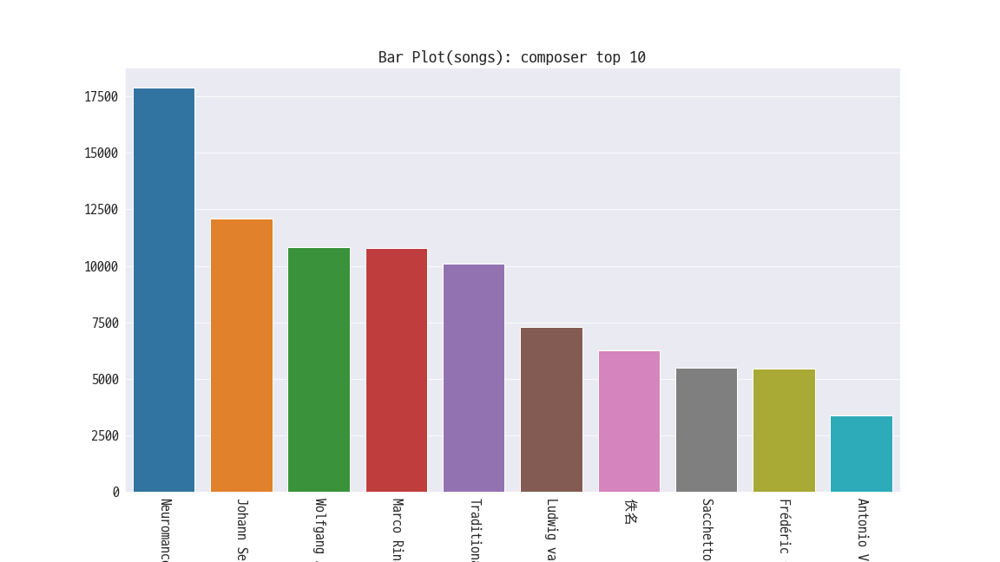

상위 10 명의 가수를 확인한 결과 Neuromancer가 가장 많은 빈도를 차지했다.  

** lyricist**

lyricist는 작사가 이름이다. 

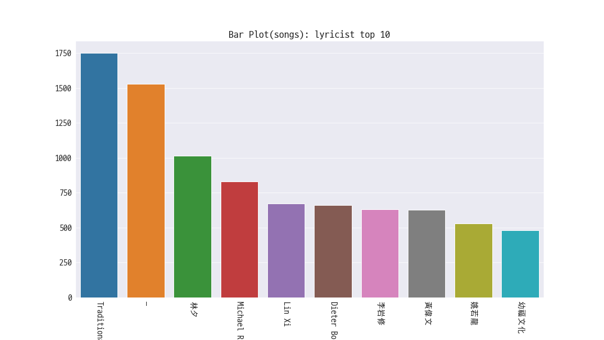

상위 10 명의 가수를 확인한 결과 Traditional이 가장 많은 빈도를 차지했다.  

** language**

language는 노래의 언어이다. 숫자로 표현되어 있다.

언어 52가 가장 많은 빈도를 차지하고 있다. 언어 -1은 사실상 비어있는 값을 의미한다.  

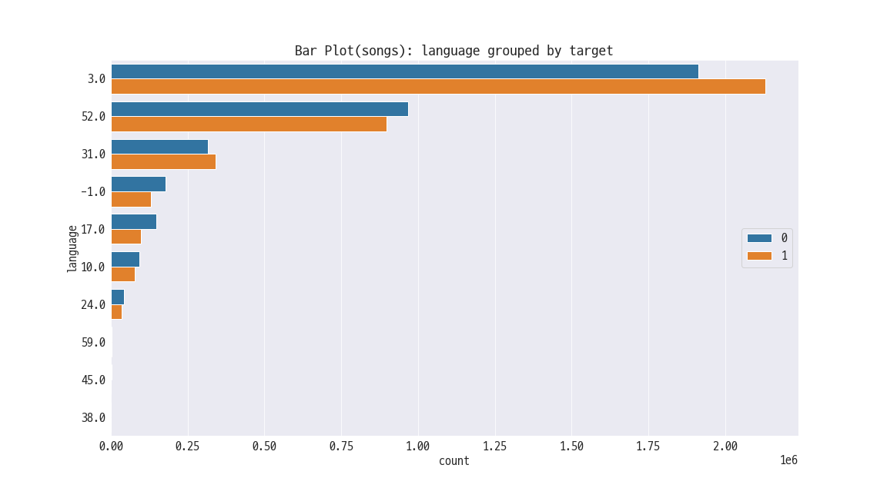

target에 영향을 주는 language 값을 특정하기 어렵다. 

위의 그래프와 비교해보았을 때 언어 52보다 언어 3이 더 많은 것을 알 수 있다. 이는 노래의 속성으로는 언어 52가 가장 많지만 사람들이 들은 노래는 언어 3으로 된 노래가 가장 많다는 것을 알 수 있다. 언어 3의 노래는 그 수는 적지만 많은 사용자가 들은 노래이다.

 노래에 대한 데이터를 분석한 결과 다음과 같은 특징을 보인다.

1. 노래 길이는 3분에서 4분 사이이지만 이상치가 많다.
2. 장르 495가 가장 많은 빈도. 나머진느 파레토 법칙에 따라 미미.
3. 가수, 작곡가, 작사가에 대한 정보는 노래는 모델의 feature로는 부적합. 너무 많은 카테고리를 표현하는 것은 큰 의미가 없다. 
4. 특정 언어 52에 집중되어 있다. 하지만 사용자는 언어 3의 노래를 많이 들었다.
5. target에 큰 영향을 미치는 변수 부재. 

songs.csv는 데이터에 저장된 사용자의 특성을 파악하는데 도움이 될 수 있지만, target 값을 예측하는데는 큰 도움이 되지 않을 것으로 예상한다.

---

## **3. Conclusion**

결론적으로 target 값을 예측하기 위해서는 songs.csv 또는 members.csv 보다는 trainc.csv에 있는 변수를 활용하는 것이 중요하다.