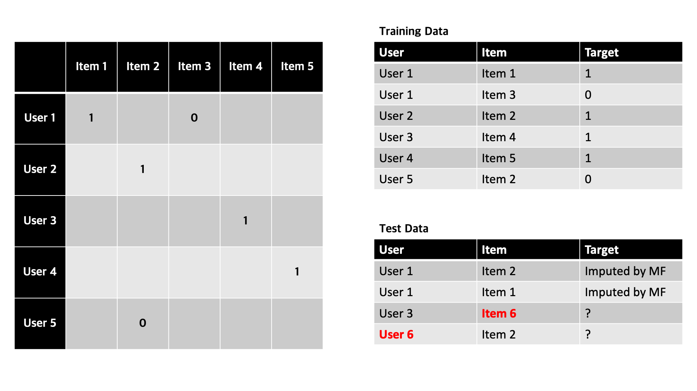
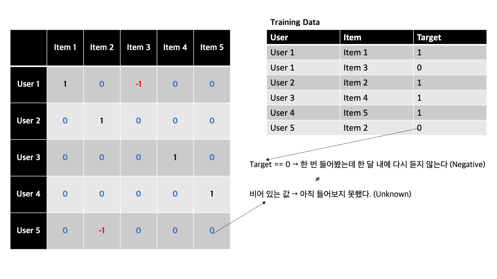
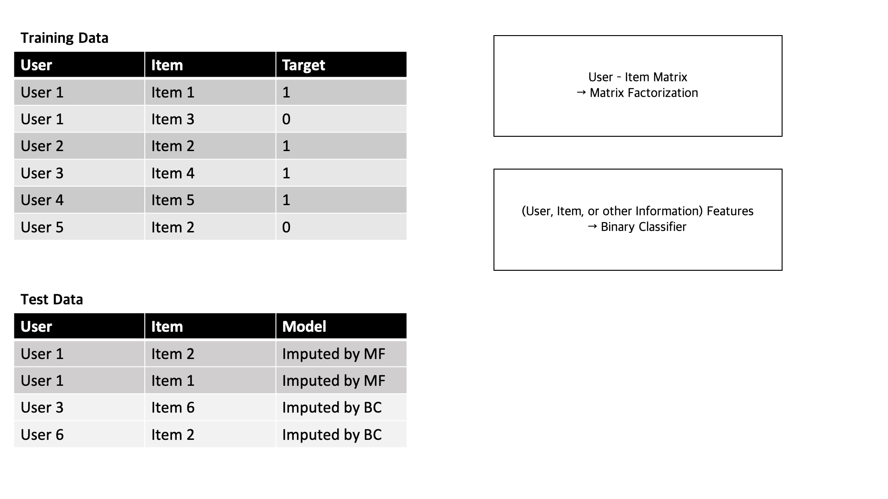
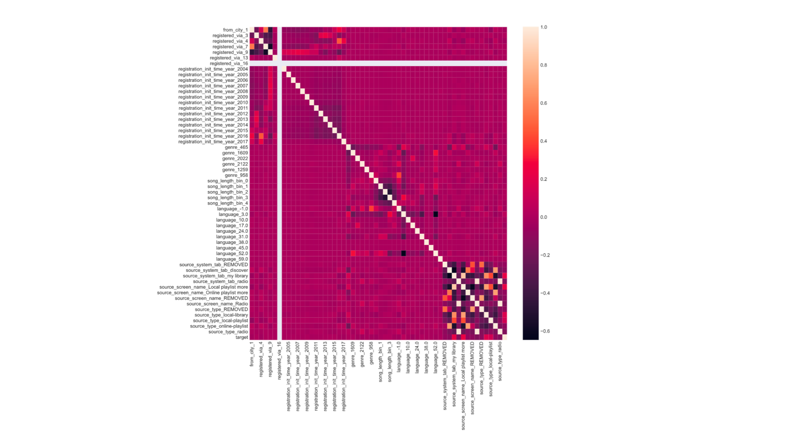
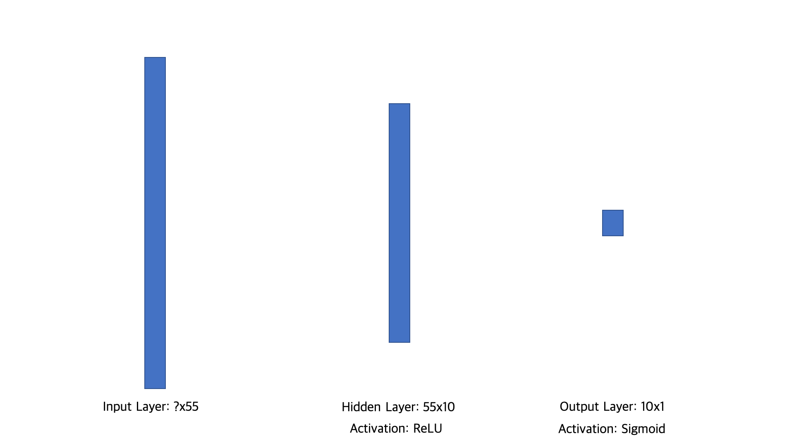

**Model v2**
==========================

Model v2는 Model v1이 가지는 Cold Start 문제를 해결하기 위해 신경망을 도입한다.기존의 Model v1의 성능 0.54600 의 정확률을 0.58346 으로 높인다.

## **1. Model v1의 문제와 해결**

Model v1은 사용자-아이템 행렬을 Matrix Facorization 한 이후 비어 있는 값을 추론하는 방법의 추천 시스템이다. Model v1에서는 다음과 같은 한계점이 있다.

1. 학습용 데이터에 없는 사용자, 아이템에 대해서 예측해야한다. (Cold Start Problem)
2. 한 달 안에 다시 노래를 듣지 않은 것과 아에 노래를 듣지 않는 것 사이의 구분이 없다. (Negative Feedback)

### **1) Cold Start Problem**

Cold Start Problem은 추천 시 정보가 없는 사용자 또는 아이템에 대해 추천하는 문제를 의미한다. Matrix Facorization을 활용한 Collaboratice Filtering 기반 추천 시스템은 사용자의 아이템 이용 정보가 추천의 근간이 된다. 하지만 신규 사용자 또는 신규 아이템에 대해서는 이용 정보가 없으므로 Collaborative Filtering 추천 시스템에서는 Cold Start 문제를 해결하기 어렵다.

위의 예시에서도 사용자 {User 1, User 2, User 3, User 4, User 5}와 아이템 {Item 1, Item 2, Item 3, Item 4, Item 5}는 학습 데이터에 포함되어 있으므로, 이들 간의 관계를 Matrix Factorization을 통해 결정할 수 있다. 

하지만 만약 신규 사용자 User 6나 신규 아이템 Item 6와 기존 사용자 또는 아이템 간의 관계를 결정할 수 없다. 

Cold Start 문제를 해결하기 위해서 Content Based 추천 시스템이 필요하다. Content Based 추천 시스템은 사용자의 아이템 이용 정보가 아니라 사용자의 특징 또는 아이템의 특징을 기반으로 추천이 이루어진다. 따라서 특징을 찾고 해당 특징을 기반으로 Binary Classification 문제를 해결하는 방법으로 접근한다.

### **2) Negative Feedback**

Model v1에서는 사용자-아이템 행렬의 성분을 target 값으로 하였다. 그 결과 학습용 데이터에 있는 사용자-아이템 조합의 target 값이 0이면 행렬의 성분도 0이 되는데 이는 학습용 데이터에 없는 사용자-아이템 조합에 대응하는 행렬 성분과 동일한 값(0)이다.

같은 0이지만 둘의 의미는 상당히 다르다. 학습용 데이터에 있는 사용자-아이템 조합의 target 값이 0인 경우는 사용자가 노래(아이템)을 한 번 들었지만, 그 노래를 한 달 내에 다시 재생하지 않는 것을 의미한다. 사용자는 노래에 대해 부정적인 평가를 내린 것이다. 하지만 학습용 데이터에 없기 때문에 행렬의 값으로 초기화된 성분 값 0은 앞으로 예측해야하는 대상으로 모르는(Unknown) 한 상태이다.

둘의 의미를 구분하기 위해서 학습용 데이터에 있는 사용자-아이템 조합 중 target의 값이 0인 경우 행렬로 변환시 성분의 값을 -1로 하였다. 이를 통해 부정적인 피드백과 결정되지 않은 피드백을 의미상 구분하였다.

## **2. Model v2 구조**

Model 2에서는 Collaboartive Filtering과 Content Based Filtering을 모두 사용한다.

### **1) Collaboratice Filtering - Matrix Factorization**

Model 1에서 사용한 Matrix Factorization를 기본적으로 유지한다. 학습용 데이터에 있는 사용자-아이템의 조합을 사용자-아이템 행렬로 변환한다. 이때 target 값이 0일 때 가지는 부정적 피드백의 의미를 살리기 위해, target 값이 0일 때 행렬의 성분은 -1로 설정한다.

부정적 피드백을 살린 사용자-아이템 행렬을 Matrix Factorization 하고, 분해된 행렬 U, Σ, V를 기반으로 비어 있는 값(0인 성분)을 추론한다. 추론된 값은 사용자가 아이템에 대해 가지는 rating으로 간주할 수 있으며, rating이 임계값을 넘으면 한 달 안에 사용자가 노래(아이템)을 다시 들을 것이라고 예측한다(target = 1). 원래의 행렬의 성분에 -1이 있었으므로 임계값은 0 근처에서 형성될 것이다. 최적의 임계값을 찾는 과정은 검증용 데이터를 통해 실험한다.

### **2) Content Based Filtering - Neural Network Binary Classification** 

Model v1에서는 정보가 없는 신규 사용자 또는 신규 아이템에 대해서 0으로 일괄 예측하였다. 하지만 Model v2는 주어진 정보를 활용해서 특징(feature)을 찾고, 특징을 바탕으로 target 값을 예측하는 Binary Classification 문제로 간주한다.

학습용 데이터에는 사용자와 아이템에 대한 이용정보만 있는 것이 아니라 사용자에 대한 특징, 아이템에 대한 특징, 심지어 청취 행위에 대한 특징까지 가지고 있다. 이러한 정보를 바탕으로 특징 벡터을 추출하는 것이 중요하다.

학습용 데이터에서 추출된 특징을 바탕으로 target 값 예측하는 모델을 생성한다. target 값은 0 또는 1이므로 Binary Classification 문제가 된다. Nueral Network를 사용해서 모델을 생성한다.    
               
 최종적으로 Model v2는 테스트 데이터에 대해서 학습용 데이터에 있는 사용자-아이템 조합이라면 기존의 Collaborative Filtering을 사용해서 예측하고, 학습용 데이터에 없는 신규 사용자 또는 신규 아이템이라면 Binary Classification 모델을 기반으로 target 값을 예측한다. 

## **3. Model 생성**

Matrix Factorization 을 사용하는 방법은 Model v1과 유사하므로 Binary Classification Neural Network Model을 생성하는 과정을 상세히 살펴본다.

### **1) 특징 추출(Feature Engineering)**

제공된 데이터는 사용자에 대한 데이터 members.csv, 노래에 대한 데이터 songs.csv, 사용자가 노래를 듣는 행위와 관련된 데이터 train.csv 가 있다. 이러한 데이터를 가지고 학습에 사용할 특징을 추출한다.

#### **members.csv**

members.csv는 사용자와 관련된 정보가 있다. members.csv에 있는 정보 중 사용자의 특징으로 사용할 수 있는지 판별한다.

|columns name|description|selected as feature|reason|
|------------|-----------|-------------------|------|
|city|사용자가 속한 도시|도시 1 출신인지 아닌지를 나타내는 특징(from_city_1)으로 변환|너무 많은 카테고리 + 앞도적으로 많은 city 1|
|bd|사용자 나이|사용하지 않음|이상치(0과 100 사이가 아닌 값)가 많음|
|gender|사용자 성별|사용하지 않음|누락값이 많음|
|registed_via|사용자의 가입 경로|6개의 카테고리 그대로 사용||
|registration_init_time|사용자의 가입 일시|년도 값만 사용||
|expiration_date|사용자의 가입 만료 일시|사용하지 않음|이상치(1970년과 같이 오래된 값)가 많음|

각 정보에 대해서 일정한 전처리를 통해 특징을 선택한다. 선택된 특징은 사용자를 나타내는 특징이다.

#### **songs.csv**

songs.csv는 노래와 관련된 정보가 있다. songs.csv에 있는 정보 중 사용자의 특징으로 사용할 수 있는지 판별한다.

|columns name|description|selected as feature|reason|
|------------|-----------|-------------------|------|
|song_length|노래 길이|동일한 개수를 가진 5개의 계급으로 나누어서 사용||
|genre_ids|노래의 장르|최빈의 장르 일분에 대해서만 노래가 장르에 속하는지 판별||
|artist_name|가수|사용하지 않음||
|composer|작곡가|사용하지 않음||
|lyricist|작사가|사용하지 않음||
|language|노래의 언어|누락치는 31로 채워넣고 10개의 카테고리 그대로 사용||

각 정보에 대해서 일정한 전처리를 통해 특징을 선택한다. 선택된 특징은 노래를 나타내는 특징이다.

#### **train.csv**

train.csv는 사용자가 노래를 듣는 행위와 관련된 정보가 있다. train.csv에 있는 정보 중 청취 특징으로 사용할 수 있는지 판별한다.

|columns name|description|selected as feature|reason|
|------------|-----------|-------------------|------|
|source_system_tab|어떠한 기능으로 노래를 듣는지|target을 잘 구분하는 값을 제외하고 나머지 묶어서 그룹화한 후 특징으로 사용||
|source_screen_name|노래 듣는 사용자 화면|target을 잘 구분하는 값을 제외하고 나머지 묶어서 그룹화한 후 특징으로 사용||
|source_type|어디에서 노래를 듣는지|target을 잘 구분하는 값을 제외하고 나머지 묶어서 그룹화한 후 특징으로 사용||

각 정보에 대해서 일정한 전처리를 통해 특징을 선택한다. 선택된 특징은 사용자의 노래 청취를 나타내는 특징이다.

범주형 데이터를 one-hot 인코딩으로 변환하면 총 55개의 특징이 선택된다. 55개의 특징에 대한 상관관계를 히트맵으로 표현한다.

### **2) Neural Network Modeling**

Tensorflow를 사용해서 신경망 모델을 작성한다. 

입력되는 특징으 55개이다. Hidden Layer에서는 이를 10개로 축소한다. Output Layer에서는 최종 Binary Classification을 위해 Sigmoid를 사용한다. Sigmoid 결과 0.5 이상은 target 값이 1이라고 예측한다.

Adam Optimizer를 사용했으며 3번의 epoch으로 충분히 학습할 수 있었다. 

## **4. Conclusion**

### **1) Submission Results**

제출결과 0.58346으로 이전에 비해 뛰어난 높은 성능 향상을 보였다. 하지만, 여전히 KKBox의 Benchmark를 도달하지 못하였으며 개선이 필요하다.

### **2) 개선점**

Binary Classification 모델을 다양하게 실험한다. 복잡합 신경망 모델 뿐만이 아니라 통계적 기법을 활용한 모델을 적용해서 최적의 모델을 찾는다. 
